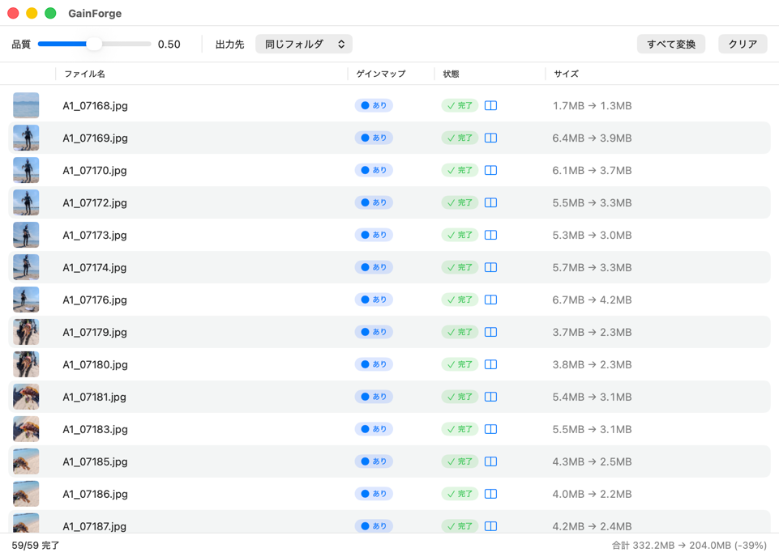

# GainForge

HDR ゲインマップ付き JPEG を、ゲインマップを保持したまま HEIC に変換する macOS ツールです。

- **GainForgeCore**: 変換ロジック（Swift Package ライブラリ）
- **CLI** (`gainforge`): コマンドライン変換ツール
- **GUI**: macOS アプリ（SwiftUI、Core を参照）

出力は「SDR ベース画像 + ISO ゲインマップ」で、写真アプリと同じ HDR 構造です。
元のカラーゲインマップを Display P3 PQ のまま生転写するため、写真アプリ書き出しと
画素レベルでほぼ一致します。



## ダウンロード / インストール

**[GainForge 公式サイト](https://junpeiwada.github.io/GainForge/)** からダウンロードできます。
ブラウザの言語設定に応じて日本語 / 英語で表示されます。

手順の概要（詳細はサイト参照）:

1. サイトの「ダウンロード」ボタンで `.zip` を入手し、展開します。
2. `GainForge.app` を「アプリケーション」フォルダへ移動してダブルクリックで起動します。
   Apple の公証済みのため Gatekeeper 警告は出ません。

### 自動更新

アプリは [Sparkle](https://sparkle-project.org/) による自動更新に対応しています。メニュー
**「GainForge について」**で開く About 画面の「更新を確認」から手動で確認でき、
「起動時に自動で更新を確認」を有効にすると新版を定期検知して更新します
（ダウンロード→インストール→再起動まで自動）。

リリース手順・配布の仕組みは [Docs/リリース手順.md](Docs/リリース手順.md) を参照してください。

## 必要環境

- macOS 15 以降（ISO ゲインマップ対応のため）
- Swift 6 / Xcode 16 以降

## CLI

```sh
# ビルド
swift build -c release

# 変換（ファイル / フォルダを指定。フォルダは *.jpg / *.jpeg を再帰探索）
swift run gainforge <入力ファイル/フォルダ ...>
```

オプション:

| オプション | 説明 |
| --- | --- |
| `-q 0.0-1.0` | HEVC 品質（既定 0.6） |
| `-o 出力先` | 出力フォルダ（省略時は入力と同じ場所に `.heic`） |
| `-f` | ゲインマップ無し画像も SDR HEIC として変換 |
| `-x`, `--hdr` | ゲインマップ無し画像を **HDR 自動補正**（明部加重カーブ）して変換（`-f` 相当を含む） |
| `-m`, `--hdr-ml` | 同じく HDR 自動補正だが、Apple 写真の実 HDR から学習した色→ゲイン LUT を使う |
| `--warm N` | 明部だけ色温度を調整（`-1.0`〜`1.0`、既定 `0`＝無効。正で暖色） |
| `--tint N` | 明部だけグリーン⇔マゼンタへ調整（`-1.0`〜`1.0`、既定 `0`＝無効。正でマゼンタ）。輝度中立 |
| `-y`, `--overwrite` | 既存の出力ファイルを上書き（既定はスキップ） |
| `--mpix N` | アスペクト維持で総画素数（百万画素）へ縮小（例 `--mpix 8`） |
| `-w`, `--width px` | アスペクト維持で横幅（px）へ縮小 |
| `--height px` | アスペクト維持で縦幅（px）へ縮小 |
| `-h`, `--help` | ヘルプ |

ゲインマップ無しの画像は `-f` / `-x` / `-m` のいずれかを付けない限りスキップします。

`--warm` / `--tint` は **`-x` / `-m` と併用したときだけ**効きます（SDR 保存とゲインマップ付き入力の
生転写には作用しません）。両方 `0` のときの出力は指定しなかった場合と同一です。GUI ツールバーの
「明部の色 (+1.00 / +0.45)」は色温度→ティントの順の表示なので、CLI では次のように書きます:

```sh
# Apple 学習 LUT で HDR 補正し、明部だけを暖色（+1.00）・マゼンタ寄り（+0.45）へ
swift run gainforge -m --warm 1.00 --tint 0.45 <入力ファイル/フォルダ ...>
```

リサイズは縮小のみで、`--mpix` / `-w` / `--height` は最後に指定したものが有効です。

## GUI

JPEG / フォルダをドラッグ&ドロップして一括変換できる SwiftUI アプリです。

主な機能:

- ドロップした JPEG / フォルダ（再帰）を一覧に追加します。重複は自動で排除されます
- 各行にサムネ・ゲインマップ有無・状態・サイズ（変換前 → 変換後）を表示します
- **並列変換**: コア数に応じて複数枚を同時変換します（上限あり）。1 件完了するたびに該当行をライブ更新します
- 出力先は「入力と同じフォルダ」/「指定フォルダ」から選択できます（品質・出力先は永続化されます）
- ツールバーの **SDR画像** ボタンから、ゲインマップ無しの入力にだけ効く設定をまとめて開けます。押すとポップオーバーで次の 2 つを設定できます（ボタンのラベルには現在の設定が要約表示されます）
  - **変換方法**: 「SDRで保存」/「HDR補正（カーブ）」/「HDR補正（ML/LUT）」（CLI の `-f` / `-x` / `-m` に対応）
  - **明部の色**: 色温度・ティントの 2 軸（各 `-1.0`〜`1.0`。CLI の `--warm` / `--tint` に対応）。HDR 補正を選んでいるときだけ有効です
- 書き出し時に**縮小**できます（総画素数 / 横幅 / 縦幅。CLI の `--mpix` / `-w` / `--height` に対応）
- 変換中に中止できます（実行中の 1 件は完走させ、未処理行は待機のまま残ります）

#### 比較ビューワ

変換前後を並べて確認できる比較ビューワを内蔵しています。


### ビルド / 実行

Xcode プロジェクトは [App/](App/) 配下にあります（`App/GainForge.xcodeproj`）。

```sh
open App/GainForge.xcodeproj
# Xcode で GainForge スキームを Run

# プロジェクトファイルは XcodeGen 管理（App/project.yml）。再生成する場合:
cd App && xcodegen generate
```

## テスト

```sh
# Core / CLI のロジックテスト
swift test

# GUI（AppViewModel）のテスト
xcodebuild -project App/GainForge.xcodeproj -scheme GainForge -destination 'platform=macOS' test
```

## ドキュメント

- 仕様・アーキテクチャ: [Docs/仕様.md](Docs/仕様.md)
- 画面仕様: [Docs/画面仕様.md](Docs/画面仕様.md)

移植元: AISandbox リポジトリ `HDRHEIF/`（実証・検証済み）。
